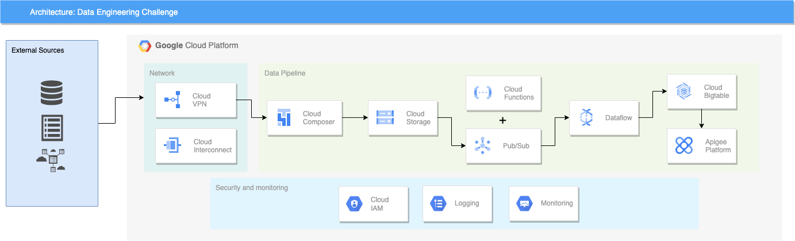

# Desafio de Engenharia de Dados na Google Cloud Platform

## Cenário

No seguinte cenário você é a pessoa engenheira de dados por trás do projeto de data ops junto a uma grande operadora de cartões de crédito. Os dados a serem ingeridos e analisados em nossa plataforma de Big Data são dados de compras (trasacao), documentos (contrato) e dados de compradores (cliente), advindos de um ftp, os quais devem ser alvo de um processo de ETL e disponibilizados via API.

Imagine que o Json das notas fiscais e outros arquivos devem ser disponibilizados em uma API, advindos de um ftp. Como você utilizaria as tecnologias da GCP para ingerir, transformar e, eventualmente, carregar esses dados em um BigTable (você tem liberdade quanto a montagem dessa última camada de serviço)?

Este entregável consiste na construção de uma arquitetura de ingestão dos dados de nota fiscal do entregável anterior (como visto aqui), a qual deve atender aos seguintes pontos:

Esquemas de fluxo de dados;
Descrições de funcionamento (se necessário);
Nomes de tecnologias em ecossistema GCP (serviços, conectores, bibliotecas e módulos).
Será apreciado como esforço extra se você conseguir avançar mais na aplicação para além do já mencionado.

Lembre-se que, como parte do entregável, esperamos que alguns comentários sejam incluídos em sua solução; queremos entender melhor como foi seu processo de solução de problemas, quais as hipóteses levantadas e, se tivesse mais tempo, como você poderia melhorar a implementação proposta (desenvolvimento incremental).

Ou seja, temos o seguinte entregável:

Arquitetura exemplo de ingestão de dados (ecossistema GCP).

# Solução 

Arquitetura proposta para o desafio:

A arquitetura da solução começa com a representação dos sistemas externos a cloud, ou seja, a infraestrutura onpremise onde está hospedado o servidor ftp, que é a origem dos arquivos em questão. 

Como base da infraestrutura de Cloud, estão representados no diagrama de arquitetura os requisitos de rede para a conexão com o servidor onpremise à nuvem bem como detalhes de segurança. Nessa útlima, temos a existência de perfis no IAM, que é a forma da Google Cloud para gerenciar permissões entre projetos e recursos além de Logging e Monitoramento do pipeline de dados, que fazem parte da suite de ops oferecido pela GCP, o Cloud Operations, anteriormente conhecido como Stackdriver. 

O pipeline de dados em si começa com o Cloud Composer, que é a versão gerenciada do popular Aiflow, um dos principais sistemas de orquestração de workflows atualmente. Para isso, seria criada uma DAG usando o operador SFTP Connection, disponível no presente [link](https://airflow.apache.org/docs/apache-airflow-providers-sftp/stable/connections/sftp.html). Essa DAG seria agendada para execução a cada meia hora ou a cada hora, visto que o Airflow não é feito para processar dados streamings e a princípio, esse não é um requerimento do problema para ingestão a partir do servidor ftp. A DAG iria enviar os arquivos coletas para buckets no Cloud Storage (a organização dos buckets fica a critério do problema). 

A etapa seguinte do pipeline é uma Cloud Function, que terá como trigger a inserção de arquivos no Cloud Storage. Então será disparado um evento para o PubSub, produto de mensageria da GCP, informando quais arquivos deverão ser processados. Em seguida, um job no dataflow, de preferência através de um template, processará esses arquivos e irá envia-los após o tratamento para o BigTable. 

Aqui é necessário comentar sobre a importância de modelagem de dados na etapa do BigTable. Por ser um banco de dados distribuido, ele possui uma série de recomendações que devem ser seguidas para conseguirmos uma boa performance. Todos os elementos de tabela no BigTable, especialmente as chaves de linha (row keys), devem ser projetados com as solicitações de leitura planejadas previamente. Outra grande preocupação é não usar números sequencias em uma chave de linha, por conta do risco de se criar os chamados hotsotps nos nodes de processsamento no cluster do BigTable. Essas e outras recomendações de boas práticas acerca dessa poderosa ferramenta da GCP podem ser encontradas no seguinte [link](https://cloud.google.com/bigtable/docs/schema-design).

A última parte do pipeline é a disponilização de dados através de uma API. Para essa etapa, foi escolhido o produto Apigee da GCP, que é uma plataforma para desenvolver e gerenciar APIs. 

## Comentários sobre alternativas

Nessa seção serão discutidas algumas alternativas de arquitetura para o problema proposto. A começar por uma possível redução de custo na parte de ingestão de dados. O Cloud Composer não é um produto barato e uma possível alternativa a ele seria ter um agendamento via CRONTAB no servidor ftp com comandos da sdk (gsutil) da GCP para enviar arquivos para o Cloud Storage. Embora essa alternative não seja muito interessante do ponto de vista de governança e orquestração, com certeza reduziria bastante o custo do pipeline. 

Também vale um comentário sobre a ferramenta de processamento de dados escolhida. É possível realizar essa etapa através do Spark, ou seja, Dataproc, sobretudo com o recém lançado Dataproc Serveless. Mas é uma recomendação da própria GCP que processamento de grandes quantidades de dados com alta frequência de processamento seja feito usando o Dataflow, ou seja, o Apache Beam. 

Outro ponto a se destacar é a necessidade de se usar o BigTable. Como o problema necessita que os dados sejam servidos a uma API com uma velocidade de resposta adequada, o BigTable se faz necessário por conseguir entregar um SLA apropriado. Caso a demanda fosse para servir os dados com propósito de análise, o BigQuery seria a escolha ideal. 

Por último, com relação a API, também era possível utilizar o API Gateway da GCP e ter o backend da API idealmente no Cloud Run ou no App Engine. A escolha do Apigee se deu por se tratar de uma plataforma bem robusta para gerenciamento de APIs e pelo suposição da existência de uma grande número de APIs na empresa, ou seja, de um ecosistema que iria se beneficiar muito de um sistema para gerenciamento de APIs. Nesse [link](https://cloud.google.com/blog/products/application-modernization/choosing-between-apigee-api-gateway-and-cloud-endpoints) é possível encontrar um discussão interessante sobre APIs na GCP e escolha entre os produtos Apigee, API Gateway e Cloud Endpoints. 